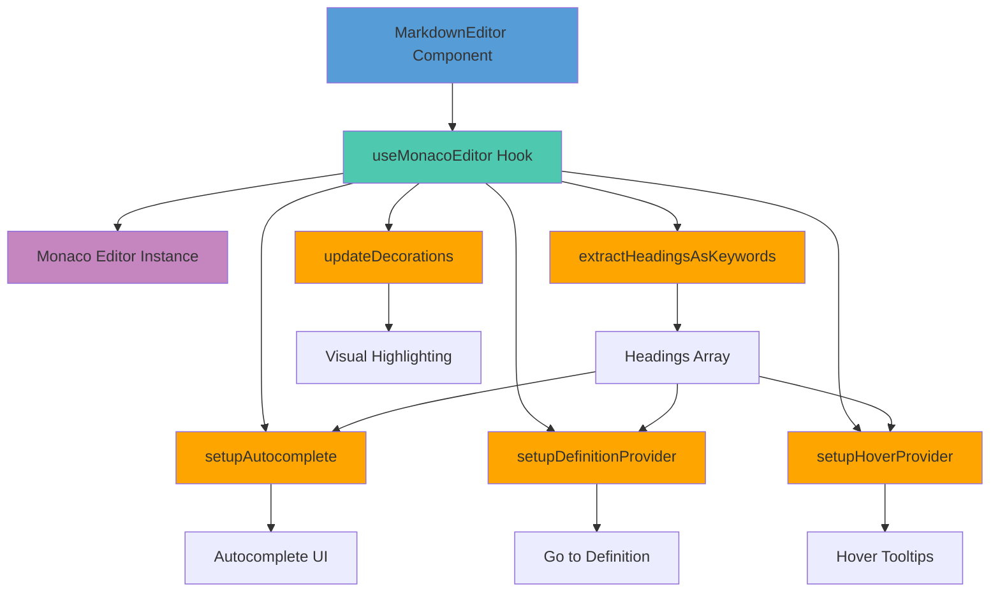
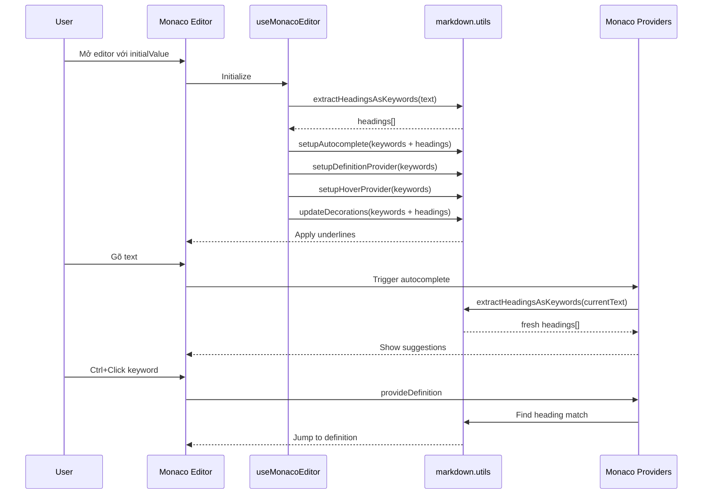

# 📝 Markdown Editor - Architecture Flow

> Sơ đồ luồng xử lý và các thành phần chính của Monaco-based Markdown Editor

## 🏗️ Component Architecture



## 🔄 Data Flow



## 📦 Core Components

### 1. **MarkdownEditor Component**
```
Props: value, onChange, disabled, placeholder
└─ useMonacoEditor hook
   └─ Quản lý Monaco instance và providers
```

**Trách nhiệm:**
- Nhận registries từ store
- Extract keywords từ registries
- Pass keywords vào hook

---

### 2. **useMonacoEditor Hook**
```
Input: initialValue, onChange, disabled, keywords[]
Output: containerRef, editorRef, setValue()
```

**Trách nhiệm:**
- Tạo Monaco Editor instance
- Setup theme (custom-dark)
- Register providers một lần
- Sync value changes
- Update decorations khi keywords thay đổi

---

### 3. **extractHeadingsAsKeywords()**
```
Input: text string
Output: Array<{ text, type, line }>
```

**Trách nhiệm:**
- Parse markdown headings (# Title)
- Handle Windows CRLF line endings
- Clean markdown formatting (bold, italic, etc.)
- Return heading metadata

**Logic:**
```
Mỗi dòng → trim() → match /^(#{1,6})\s+(.+)$/
→ Clean title → Add to array
```

---

### 4. **setupAutocomplete()**
```
Input: editor, keywords[]
Output: disposable
```

**Trách nhiệm:**
- Register CompletionItemProvider
- **Dynamic:** Extract headings mỗi lần trigger
- Skip suggestions khi đang gõ trên heading line
- Fuzzy match keywords với text

**Flow:**
```
User gõ → provideCompletionItems() trigger
→ extractHeadingsAsKeywords(currentText)
→ Merge static keywords + headings
→ Fuzzy match với text before cursor
→ Return suggestions[]
```

---

### 5. **setupDefinitionProvider()**
```
Input: editor, keywords[]
Output: disposable
```

**Trách nhiệm:**
- Register DefinitionProvider
- **Dynamic:** Extract headings khi F12/Ctrl+Click
- Handle multi-word keywords
- Find exact heading match

**Strategy (ưu tiên cao → thấp):**
1. **Exact heading match** - Tìm heading khớp chính xác
2. **Explicit comment** - `<!-- Define: keyword -->`
3. **Partial heading** - Heading chứa keyword
4. **First occurrence** - Lần xuất hiện đầu

**Multi-word handling:**
```
Click position → Check tất cả keywords
→ Tìm keyword có range chứa click position
→ Return definition location
```

---

### 6. **setupHoverProvider()**
```
Input: editor, keywords[]
Output: disposable
```

**Trách nhiệm:**
- Register HoverProvider
- **Dynamic:** Extract headings khi hover
- Handle multi-word keywords
- Show tooltip

**Output:**
```
Keyword name (bold)
Type: heading-1, hashtag, etc.
Hint: "Ctrl+Click or F12 to go to definition"
```

---

### 7. **updateDecorations()**
```
Input: editor, text, keywords[], decorationsRef
Output: void (updates decorations in-place)
```

**Trách nhiệm:**
- Apply visual highlighting (underline)
- **Skip heading lines** - Không underline title gốc
- Chỉ underline references
- Handle URLs

**Logic:**
```
1. Detect heading lines → Set<number>
2. Foreach keyword:
   - Find matches
   - Skip if on heading line
   - Add decoration (underline + color)
3. Apply decorations
```

---

## 🎯 Key Features

### ✅ Dynamic Heading Extraction
- Headings tự động trở thành keywords
- Extract mỗi khi autocomplete/hover/definition trigger
- Không cần manual registration

### ✅ Multi-word Keyword Support
- "Usage Guide" hoạt động như 1 keyword
- Click bất kỳ đâu trong "Usage Guide" → works
- Custom logic thay vì `getWordAtPosition()`

### ✅ Smart Decoration
- Heading lines: Không underline
- References: Có underline + clickable
- Visual feedback: Hover shows pointer cursor

### ✅ Cross-reference Navigation
- Ctrl+Click / F12 → Jump to heading
- Exact match priority
- Fallback strategies

---

## 🔧 Technical Details

### Provider Registration
- **One-time setup** ở hook initialization
- Pass **static keywords only**
- Providers tự extract headings mỗi lần

### Performance
- Lazy extraction: Chỉ extract khi cần
- No re-registration: Providers setup once
- Efficient regex matching

### Windows Compatibility
- Handle CRLF (`\r\n`) line endings
- Trim lines trước khi parse
- Robust regex patterns

---

## 📊 Data Structure

### Keyword Object
```typescript
{
  text: string,        // "Introduction" or "#urgent"
  type: string,        // "heading-1" or "hashtag" or "status"
  line?: number        // Line number (for headings only)
}
```

### Heading Types
```
heading-1  →  # Title
heading-2  →  ## Title
...
heading-6  →  ###### Title
```

### Static Keyword Types
```
hashtag    →  #tag
status     →  #active, #inactive
keyword    →  function, const
class      →  MyClass
type       →  string, number
comment    →  TODO, FIXME
```

---

## 🎨 Styling

### CSS Classes
```css
.keyword-heading-1 ... .keyword-heading-6
.keyword-hashtag
.keyword-status
.keyword-keyword
.keyword-class
.keyword-type
.keyword-comment
```

**All keywords:**
- `text-decoration: underline`
- `cursor: pointer`
- Custom color per type

---

## 🚀 Usage Example

```markdown
# Introduction
This section explains basics.

# Usage Guide
How to use the feature.

Check the Introduction section first.  ← "Introduction" underlined
Then see Usage Guide for details.       ← "Usage Guide" underlined

# Introduction                          ← NOT underlined (heading line)
```

**Interactions:**
- Gõ "Intro" → Autocomplete suggests "Introduction"
- Ctrl+Click "Introduction" → Nhảy đến `# Introduction`
- Hover "Usage Guide" → Tooltip: "heading-2, Click to go..."

---

## 📝 Summary

**Core Principle:** 
> Headings = Keywords, References = Underlined, Definitions = Navigate

**Architecture:**
> Component → Hook → Utils → Providers → User Interaction

**Performance:**
> Static registration + Dynamic extraction = Best of both worlds
